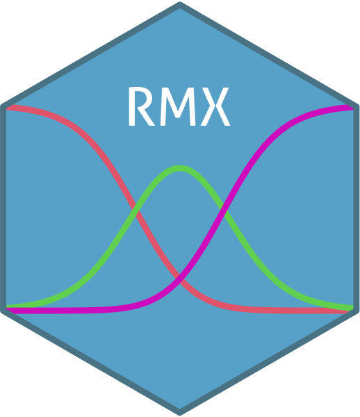

# RMX 

<!-- badges: start -->
[](https://cran.r-project.org/web/checks/check_results_RMX.html)
[](https://cran.r-project.org/package=RMX)
<!-- badges: end -->

>_"But Rasch would have wondered about what happened to the use of graphs. And I think he would have been quite justified in this.
Could it be that we have used computers in a wrong way? Since Rasch retired from active duty, have we emphasized the power of computers
to do complicated calculations and solving complicated equations over the power of the computers to make nice and illustrative graphs?"_
> &mdash; Erling B. Andersen[^1] 

[^1]: Andersen, E.B. What Georg Rasch Would Have Thought about this Book. In _Rasch Models. Foundations, Recent Developments, and Applications_; 
Fischer, G.H., Molenaar, I.W., Eds.; Springer: New York, NY, USA, 1995; pp. 383–390.

## What is RMX?

The `RMX` package is a tool to visualize the various aspects of Item-Response-Theory (IRT) models. The major feature is the `plotPIccc()`
function which draws the so called "PIccc".

The PIccc is a modified version of the classical Person-Item Map (also called Wright-Map). In the classical PI map
the person parameter distribution is contrasted with the item parameters. However, the item parameters are only shown as simple dots. Furthermore, it 
does not provide any information for models involving discrimination, guessing, or laziness parameters. The `plotPIccc` function overcomes these restrictions 
in several aspects. In its core the `plotPIccc` function shows the Person-Item confrontation using category characteristic curves (CCC, hence the name PIccc
for the diagram) but also many other functions, that can help visualize different aspects of the IRT model

## Why RMX?

* additional information compared to the classical Person-Item Map
* flexible selection of items and dimensions
* flexible arrangement of items accoding to characteristics other than difficulty
* various graphical options
* supports all major IRT packages of R (`mirt`, `eRm`, `ltm`, `TAM` and `psychotools`)


## Features

The `plotPIccc()` function supports two modi, either

* drawing one type of curve for a set of items (default); or
* drawing several types for one item (by providing a vector of types).


Additionally you can plot

* the test information function (TIF) for the entire set of items (`TIF=TRUE`)
* the TIF of the selected items (`sTIF=TRUE`)
* the standard error (SE) for all items (`SE=TRUE`)
* the SE of the selected items (`sSE=TRUE`)
* the kernel density estimate (`dens=TRUE`)


## Usage

Check out the <a href="articles/examples.html"> examples </a> for a more detailed description.

```r
library(RMX)

data(big5)

dat_extra = big5[,c(1,6,11,16)]

library(eRm)

res0 = PCM(dat_extra)

plotPIccc(res0)
```


